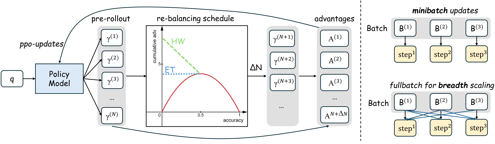

<div align="center">


<h1 style="display: flex; justify-content: center; align-items: center; gap: 10px; margin: 0;">
  Depth-Breadth Synergy in RLVR: Unlocking LLM Reasoning Gains with Adaptive Exploration
</h1>
<p align="center"><em>Difficulty adaptive rollout rebalancing with breadth-scaling to unlock simultaneous Pass@1 and Pass@K gains in RLVR.</em></p>
<div align="center">
  
</div>


<div align="center">
<a href="https://arxiv.org/abs/2508.13755v1"></a>
<a href="https://www.alphaxiv.org/abs/2508.13755v1"></a>
<a href="https://github.com/yangzhch6/DARS"></a>
<a href="https://huggingface.co/collections/yangzhch6/dars-68a6c755262b9867f420c386"></a>
</div>

</div>


# ✨Getting Started

## Prepare Data
download [https://huggingface.co/datasets/yangzhch6/DARS-Data](https://huggingface.co/datasets/yangzhch6/DARS-Data)

```
openr1.parquet: training data
capacity_val.parquet: testing data
```

## Installation

### Choice 1: Install from conda pack (Recommended)
download [https://huggingface.co/yangzhch6/dars-env](https://huggingface.co/yangzhch6/dars-env)

then,
```
mkdir -p /opt/envs/dars
tar xzf dars.tar.gz -C /opt/envs/dars

source /opt/envs/dars/bin/activate
# or
conda activate /opt/envs/dars

cd dars
pip install -e ./verl
pip install -e .
```
> This choice only works for *CUDA-12.4*


### Choice 2: Install from scratch
```
pip install -e ./verl
pip install packaging
pip install ninja
pip install flash-attn --no-build-isolation
pip install -e .
```

You may need to install flash-attention through:
```
https://github.com/Dao-AILab/flash-attention/releases/tag/v2.7.4.post1
```


# 🔧Usage

## DARS-B Training
> More experiment scripts refer to ./experiments/**.sh

**resampling_func 1**: equal treatment schedule, we set n_max = 32 for training DARS-1.5B/7B.

**resampling_func 2**: hardness weighted schedule, we set n_max = 64 for training DARS-1.5B/7B. 

```
#!/bin/bash
set -x

# Warning: Export VLLM_ATTENTION_BACKEND on every machine before starting Ray cluster.
# vLLM without XFORMERS will results in CUDA errors.
export WANDB_API_KEY="your key here"
export VLLM_ATTENTION_BACKEND=XFORMERS
export MODEL_PATH="$MODEL_PATH/Qwen2.5-Math-1.5B"
export CUDA_VISIBLE_DEVICES=0,1,2,3,4,5,6,7

# Train over a single node
python3 -m verl.trainer.main_ppo_dars \
    algorithm.adv_estimator=grpo \
    data.train_files=$DATA_PATH/openr1.parquet \
    data.val_files=$DATA_PATH/capacity_val.parquet \
    data.train_batch_size=3072 \
    data.val_batch_size=512 \
    data.max_prompt_length=1024 \
    data.max_response_length=3072 \
    data.shuffle=False \
    +data.resampling_func=1 \
    +data.use_template=True \
    +data.reward_impl_version=2 \
    +actor_rollout_ref.ref.use_ref=False \
    actor_rollout_ref.actor.ppo_epochs=2 \
    actor_rollout_ref.model.path=$MODEL_PATH \
    actor_rollout_ref.actor.optim.lr=5e-6 \
    actor_rollout_ref.model.use_remove_padding=True \
    actor_rollout_ref.actor.ppo_mini_batch_size=3072 \
    actor_rollout_ref.actor.use_dynamic_bsz=True \
    actor_rollout_ref.actor.ppo_max_token_len_per_gpu=24576 \
    actor_rollout_ref.actor.use_kl_loss=False \
    actor_rollout_ref.actor.kl_loss_coef=0.000 \
    actor_rollout_ref.actor.kl_loss_type=low_var_kl \
    actor_rollout_ref.actor.ulysses_sequence_parallel_size=1 \
    actor_rollout_ref.model.enable_gradient_checkpointing=True \
    actor_rollout_ref.actor.fsdp_config.param_offload=False \
    actor_rollout_ref.actor.fsdp_config.optimizer_offload=False \
    actor_rollout_ref.rollout.tensor_model_parallel_size=1 \
    actor_rollout_ref.rollout.name=vllm \
    actor_rollout_ref.rollout.temperature=1.0 \
    actor_rollout_ref.rollout.val_temperature=1.0 \
    actor_rollout_ref.rollout.gpu_memory_utilization=0.7 \
    actor_rollout_ref.rollout.n=8 \
    actor_rollout_ref.rollout.n_val=128 \
    actor_rollout_ref.ref.fsdp_config.param_offload=True \
    algorithm.kl_ctrl.kl_coef=0.000 \
    +algorithm.n_max=32 \
    +algorithm.grpo_use_std=False \
    trainer.critic_warmup=0 \
    +trainer.del_last_ckpt=False \
    +trainer.log_train=True \
    trainer.logger=['console','wandb'] \
    trainer.project_name='DARS' \
    trainer.experiment_name='Qwen2.5-Math-1.5B-openr1-nothink-3k-func1-bs3k-pp2' \
    +trainer.val_before_train=False \
    trainer.n_gpus_per_node=8 \
    trainer.nnodes=1 \
    trainer.save_freq=14 \
    trainer.test_freq=14 \
    trainer.default_hdfs_dir=null \
    trainer.total_training_steps=86 \
    trainer.total_epochs=30 "${@:1}"
```

## Baseline Training
refer to [dars-baseline branch](https://github.com/yangzhch6/DARS/tree/dars-baseline)


# Experimental Results

| **Model**                          | **AIME24** | **MATH-500** | **Olympiad** | **AMC** | **Minerva** | ***Avg@128*** | ***Pass@128*** |
|-----------------------------------|-------------|-------------|---------|---------------|-------------|---------------|----------|
| |
| Qwen-Math-1.5B-Base | 4.0 | 35.1 | 16.2 | 20.8 | 9.5 | 21.1 | 77.9 |
| Qwen-Math-1.5B-RLVR | 14.7 | 75.9 | 39.4 | 47.5 | 31.2 | 49.6 | 79.6 |
| DARS-1.5B-ET | 15.8 | 76.0 | 40.9 | 47.2 | 30.0 | 50.0 | 81.2 |
| DARS-1.5B-ET-Breadth | 18.6 | 79.4 | 42.9 | 50.6 | 31.7 | 52.5 | 80.8 |
| DARS-1.5B-HW | 14.7 | 76.4 | 40.0 | 48.4 | 30.8 | 50.0 | 82.1 |
| DARS-1.5B-HW-Breadth | | | | | | | |
| |
| Qwen-Math-7B-Base | 11.6 | 52.3 | 19.7 | 35.2 | 15.3 | 30.1 | 82.1 |
| Qwen-Math-7B-RLVR | 26.8 | 82.2 | 44.3 | 57.2 | 35.7 | 55.3 | 81.4 |
| DARS-7B-ET | 26.9 | 83.2 | 46.6 | 57.3 | 38.5 | 57.0 | 81.7 |
| DARS-7B-ET-Breadth | 33.3 | 83.8 | 47.8 | 61.3 | 38.4 | 58.1 | 82.1 |
| DARS-7B-HW | 30.1 | 83.5 | 47.1 | 59.4 | 37.2 | 57.3 | 83.5 |
| DARS-7B-HW-Breadth | | | | | | | |


# DARS Models
| **Model**                          | **Huggingface** |  **Base Model** |
|-----------------------------------|------------------|------------------|
| DARS-1.5B-ET | https://huggingface.co/yangzhch6/DARS-1.5B-ET |  Qwen2.5-Math-1.5B |
| DARS-1.5B-HW | https://huggingface.co/yangzhch6/DARS-1.5B-HW |  Qwen2.5-Math-1.5B |
| DARS-1.5B-ET-Breadth | https://huggingface.co/yangzhch6/DARS-1.5B-ET-Breadth |  Qwen2.5-Math-1.5B |
| DARS-1.5B-HW-Breadth | https://huggingface.co/yangzhch6/DARS-1.5B-HW-Breadth |  Qwen2.5-Math-1.5B |
| DARS-7B-ET | https://huggingface.co/yangzhch6/DARS-7B-ET |  Qwen2.5-Math-7B |
| DARS-7B-HW | https://huggingface.co/yangzhch6/DARS-7B-HW |  Qwen2.5-Math-7B |
| DARS-7B-ET-Breadth | https://huggingface.co/yangzhch6/DARS-7B-ET-Breadth |  Qwen2.5-Math-7B |
| DARS-7B-HW-Breadth | https://huggingface.co/yangzhch6/DARS-7B-HW-Breadth |  Qwen2.5-Math-7B |


# 📃Evaluation
```
python /mnt/weka/home/yongxin.wang/workspace/lark/dars/analysis_results.py --data_path [your valid generation json path]
```

# 🌻Acknowledgement
This repo builds upon [veRL](https://github.com/volcengine/verl) and [deepscaler](https://github.com/agentica-project/rllm), and utilizes [vLLM](https://github.com/vllm-project/vllm) for inference. We utilize [Math-Verify](https://github.com/huggingface/Math-Verify) for math reasoning evaluation. We thank the open-source community for datasets and backbones, [OpenR1-Math-220k](https://huggingface.co/datasets/open-r1/OpenR1-Math-220k), [Qwen2.5-Math](https://github.com/QwenLM/Qwen2.5-Math), and [DeepSeek-R1](https://github.com/deepseek-ai/deepseek-r1) model. 

# 📬 Contact
For questions, feedback, or collaboration opportunities, feel free to reach out:
- Zhicheng Yang: yangzhch6@gmail.com

# Citation
If you find our model or code useful, please kindly cite our paper:
```bib
@misc{yang2025depthbreadthsynergyrlvrunlocking,
      title={Depth-Breadth Synergy in RLVR: Unlocking LLM Reasoning Gains with Adaptive Exploration}, 
      author={Zhicheng Yang and Zhijiang Guo and Yinya Huang and Yongxin Wang and Dongchun Xie and Yiwei Wang and Xiaodan Liang and Jing Tang},
      year={2025},
      eprint={2508.13755},
      archivePrefix={arXiv},
      primaryClass={cs.LG},
      url={https://arxiv.org/abs/2508.13755}, 
}
```