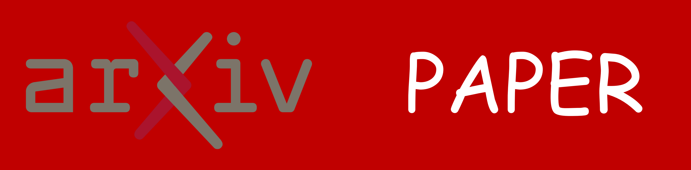
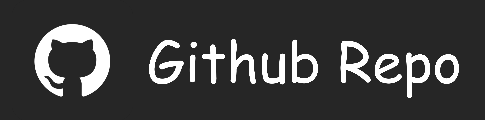

<div align="center">


<h1 style="display: flex; justify-content: center; align-items: center; gap: 10px; margin: 0;">
  Depth-Breadth Synergy in RLVR: Unlocking LLM Reasoning Gains with Adaptive Exploration
</h1>
<p align="center"><em>Difficulty adaptive rollout rebalancing with breadth-scaling to unlock simultaneous Pass@1 and Pass@K gains in RLVR.</em></p>
<div align="center">
  
</div>


<div align="center">
<a href="https://arxiv.org/abs/2508.13755v1"></a>
<a href="(https://www.alphaxiv.org/abs/2508.13755v1"></a>
<a href="https://github.com/yangzhch6/DARS"></a>
<a href="https://huggingface.co/collections/yangzhch6/dars-68a6c755262b9867f420c386"></a>
</div>

</div>


# ✨Getting Started

## Prepare Data
download [https://huggingface.co/datasets/yangzhch6/DARS-Data](https://huggingface.co/datasets/yangzhch6/DARS-Data)

```
openr1.parquet: training dats
capacity_val.parquet: testing data
```

## Installation

```
pip install -e ./verl
pip install packaging
pip install ninja
pip install flash-attn --no-build-isolation
pip install -e .
```

You may need to install flash-attention through:
```
https://github.com/Dao-AILab/flash-attention/releases/tag/v2.7.4.post1
```


# 🔧Usage

## Training
resampling_func 1: equal treatment schedule 
resampling_func 2: hardness weighted schedule 

```
#!/bin/bash
set -x

# Warning: Export VLLM_ATTENTION_BACKEND on every machine before starting Ray cluster.
# vLLM without XFORMERS will results in CUDA errors.
export WANDB_API_KEY="your key here"
export VLLM_ATTENTION_BACKEND=XFORMERS
export MODEL_PATH="$MODEL_PATH/Qwen2.5-Math-1.5B"
export CUDA_VISIBLE_DEVICES=0,1,2,3,4,5,6,7

# Train over a single node, 1 A100-80GB GPUs.
python3 -m verl.trainer.main_ppo_dars \
    algorithm.adv_estimator=grpo \
    data.train_files=$DATA_PATH/openr1.parquet \
    data.val_files=$DATA_PATH/capacity_val.parquet \
    data.train_batch_size=3072 \
    data.val_batch_size=512 \
    data.max_prompt_length=1024 \
    data.max_response_length=3072 \
    data.shuffle=False \
    +data.resampling_func=1 \
    +data.use_template=True \
    +data.reward_impl_version=2 \
    +actor_rollout_ref.ref.use_ref=False \
    actor_rollout_ref.actor.ppo_epochs=2 \
    actor_rollout_ref.model.path=$MODEL_PATH \
    actor_rollout_ref.actor.optim.lr=5e-6 \
    actor_rollout_ref.model.use_remove_padding=True \
    actor_rollout_ref.actor.ppo_mini_batch_size=3072 \
    actor_rollout_ref.actor.use_dynamic_bsz=True \
    actor_rollout_ref.actor.ppo_max_token_len_per_gpu=24576 \
    actor_rollout_ref.actor.use_kl_loss=False \
    actor_rollout_ref.actor.kl_loss_coef=0.000 \
    actor_rollout_ref.actor.kl_loss_type=low_var_kl \
    actor_rollout_ref.actor.ulysses_sequence_parallel_size=1 \
    actor_rollout_ref.model.enable_gradient_checkpointing=True \
    actor_rollout_ref.actor.fsdp_config.param_offload=False \
    actor_rollout_ref.actor.fsdp_config.optimizer_offload=False \
    actor_rollout_ref.rollout.tensor_model_parallel_size=1 \
    actor_rollout_ref.rollout.name=vllm \
    actor_rollout_ref.rollout.temperature=1.0 \
    actor_rollout_ref.rollout.val_temperature=1.0 \
    actor_rollout_ref.rollout.gpu_memory_utilization=0.7 \
    actor_rollout_ref.rollout.n=8 \
    actor_rollout_ref.rollout.n_val=128 \
    actor_rollout_ref.ref.fsdp_config.param_offload=True \
    algorithm.kl_ctrl.kl_coef=0.000 \
    +algorithm.grpo_use_std=False \
    trainer.critic_warmup=0 \
    trainer.logger=['console','wandb'] \
    trainer.project_name='DARS' \
    trainer.experiment_name='Qwen2.5-Math-1.5B-openr1-nothink-3k-func1-bs3k-pp2' \
    +trainer.val_before_train=False \
    trainer.n_gpus_per_node=8 \
    trainer.nnodes=1 \
    trainer.save_freq=14 \
    trainer.test_freq=14 \
    trainer.default_hdfs_dir=null \
    trainer.total_training_steps=142 \
    trainer.total_epochs=30 "${@:1}"
```


## Baseline Training
refer to [https://github.com/yangzhch6/rlvr-baseline](https://github.com/yangzhch6/rlvr-baseline)


# 📃Evaluation
```
python /mnt/weka/home/yongxin.wang/workspace/lark/dars/analysis_results.py --data_path [your valid generation json path]
```

# 🌻Acknowledgement
This repo builds upon [veRL](https://github.com/volcengine/verl) and [deepscaler](https://github.com/agentica-project/rllm), and utilizes [vLLM](https://github.com/vllm-project/vllm) for inference. We utilize [Math-Verify](https://github.com/huggingface/Math-Verify) for math reasoning evaluation. We thank the open-source community for datasets and backbones, [OpenR1-Math-220k](https://huggingface.co/datasets/open-r1/OpenR1-Math-220k), [Qwen2.5-Math](https://github.com/QwenLM/Qwen2.5-Math), and [DeepSeek-R1](https://github.com/deepseek-ai/deepseek-r1) model. 

# 📬 Contact
For questions, feedback, or collaboration opportunities, feel free to reach out:
- Zhicheng Yang: yangzhch6@gmail.com

# Citation
If you find our model, or code useful, please kindly cite our paper:
```bib
@misc{yang2025depthbreadthsynergyrlvrunlocking,
      title={Depth-Breadth Synergy in RLVR: Unlocking LLM Reasoning Gains with Adaptive Exploration}, 
      author={Zhicheng Yang and Zhijiang Guo and Yinya Huang and Yongxin Wang and Dongchun Xie and Yiwei Wang and Xiaodan Liang and Jing Tang},
      year={2025},
      eprint={2508.13755},
      archivePrefix={arXiv},
      primaryClass={cs.LG},
      url={https://arxiv.org/abs/2508.13755}, 
}
```